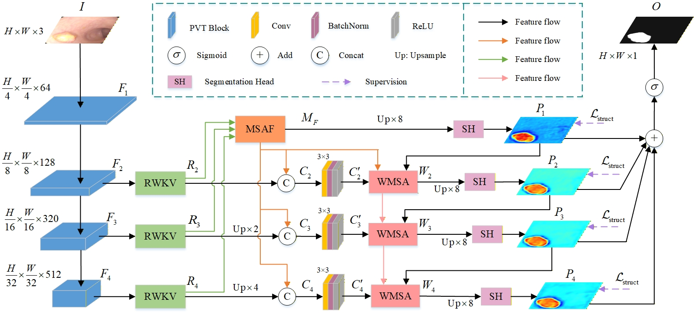

## PRMWNet：A High-Accuracy Context-Enhanced Polyp Segmentation Network via RWKV and Transformer for Complex Scenarios

### Environment

* Cuda 11.8, Python 3.10
* Pytorch 2.4.1, mmcv 1.7.0, timm, segmentation_models_pytorch

### Dataset

From this [download link (Github)](https://github.com/DengPingFan/Polyp-PVT)
